# Kitchen Catastrophe Word Game

Kitchen Catastrophe is a word game aimed at providing light entertainment while also serving to test and better user's knowledge of food and drink vocabulary. Levels begin with easier 4 and 5 letter words in the food and drink categories. These build to 5 and 6 letter words in levels 3 and 4. When the user reaches level 5 their unscrambling skills and foodie knowledge is tested with a new category; cooking methods. Finally the last level is a real test with 2 ten letter words to solve!

[Visit the Kitchen Catastrophe live website here](https://llewellynksj.github.io/kitchen-catastrophe)

 

## Contents
----

### [User Experience (UX)](#user-experience-ux-1)
- [Purpose](#purpose)
- [User Stories](#user-stories)
  - [First Time Visitors](#first-time-visitor-goals)
  - [Returning Visitors](#returning-visitor-goals)
  - [Frequent Users](#frequent-visitor-goals)

### [Design](#design-1)
- [Colour Scheme](#colour-scheme)
- [Typography](#typography)
- [Imagery](#imagery)
- [Wireframes](#wireframes)

### [Features](#features-1)
- [Existing Features](#existing-features)
  - [Homepage](#homepage)
  - [Game](#game)
- [Accessibility](#accessibility)
- [Future Features](#future-features)

### [Technologies](#technologies-1)

### [Version Control](#version-control-1)

### [Deployment](#deployment-1)

### [Testing](#testing-1)
- [Function Testing](#function-testing)
- [User Story Testing](#user-story-testing)
- [Lighthouse](#lighthouse)
- [JavaScript Validator](#javascript-testing)
- [Validator Testing](#validator-testing)
- [Bugs](#bugs)

### [Credits](#credits-1)
- [Resources](#resources)
- [Acknowledgements](#acknowledgements)

 

----

 

## User Experience (UX)
### **Purpose**

Kitchen Catastrophe is a fun and light-hearted game aimed at anyone who loves a word problem and/or loves food and drink! 

 

### User Stories

### **First Time Visitor Goals** 
- I want to play an engaging word game
- I want to test my food and drink knowledge
- I want to be able to play on any of my devices
- I want to navigate easily

 

### **Returning Visitor Goals**
- I want to test my knowledge on new words
- I want to be able to decide if I can see the clues or not
- I want to be able to start the game without scrolling to the bottom of the homepage

 

### **Frequent Visitor Goals**
- I want to test my knowledge on new words
- I want to keep record of my score and challenge myself with harder levels

 

----

## Design
### **Colour Scheme**
This website uses primarily a palette of green and orange colours to reflect a fresh, clean, foodie feel. The palette was created using the [Coolors](https://coolors.co/) website.

 

### **Typography**
[Google Fonts](https://fonts.google.com/) was used to source the font styles used throughout the website:
- Andika: Used for the main body of website
- Permanant Marker: Used for the game title only

Andika was chosen as the primary font as it's in keeping with the sense of fun and games.

 

Permanant Marker was chosen as it feels in keeping with the title itself; 'Kitchen Catastrophe'. It gives a sense of calamity.

Both were also chosen to ensure maximum accessibility.

 

### **Imagery**
Images found throughout the website were sourced from [Shutterstock](https://www.shutterstock.com/).
The background image was chosen as it fit with the theme of being fun and whimsical. This background was the base of choice for the rest of the colour palette.

Photographs of real people were used (as opposed to animated/cartoon imagery). This bring a certain adult feel to the game ensuring adults know it's a game for them.

Icons used on the homepage and support page were imported through [Font Awesome](https://fontawesome.com/).

 

### **Wireframes**
To create the wireframes I used the [Balsamiq Wireframing Software](https://balsamiq.com/).

Homepage (mobile)

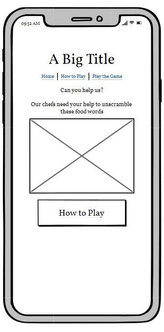

Homepage (desktop)

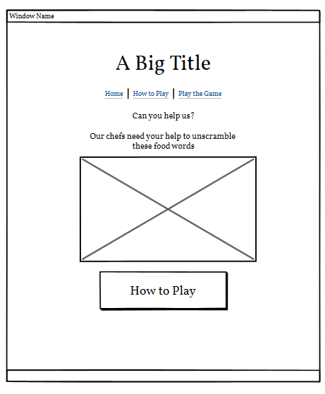

 

How to Play page (mobile)

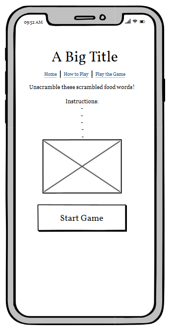

Homepage (desktop)

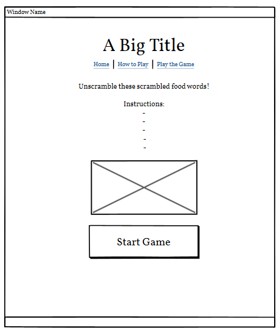

 

Game page (mobile)

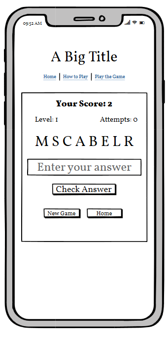

Dates page (desktop)

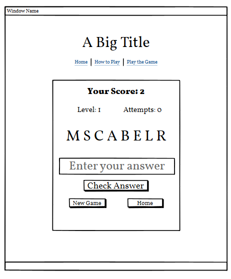

 

----

## Features
### **Existing Features**
The website has 3 main pages accessible to the user which; the homepage, the How to Play page where the game instructions can be found, and the Game page itself.

**All** pages include the following features:
- Logo: Chefs hat image

- Navigation bar: Quick links to the game and back to the homepage

- Title: Kitchen Catastrophe

 

### Homepage
The homepage is very simple and acts as a home base to set the scene for the idea behind the game. Here the user is told the premise; that the chefs need help to unscramble lots of food and drink related words.
From here they can click on the call to action button to take them to the 'How to Play' page, or they can use the navigation links at the top of the page to go straight to the game.

 

### How to Play Page
This page consists of:
- Rules
The first information the user will see is the rules/instructions. These are very straightforward and simply set out over 3 lines.

- Icons
Icons that represent the 3 categories are illustrated here and also serve to seperate the text of the rules and the levels for better UX.
 
- Levels
A list highlights what the user can expect in terms of levels and categories

- Call to action button
At the bottom of the page the user can click on the 'Start unscrambling' button to take them into the gameplay.

 

### Game Page
- Player Stats
The user will be able to see the level they are on, their score, and how many times they have got the answer wrong.

- Category
This changes dependent on the level; either food, drink, or cooking methods. All with a relevant icon.

- The scrambled word
Here the word that is all jumbled appears for the user to solve.

- User Answer box
The user answer box appears with placeholder text so that the user knows where to input their answer. Focus returns to this box after any modals are closed.

- Clue Hint
A clue is provided but only activated by using the toggle button. This means the user has a choice over making the game a little more easy/difficult.

- Buttons
Immediately under the clue is the 'Check Answer' button. A stronger font is used for this button to make it stand out better as it will be most frequently used during gameplay.

 

### Modals
Dependent on what the user has input for their answer, when the Check Answer button is clicked one of 5 possible modals will show. These include:
 - Advises user their answer is correct
 - Advises user their answer is incorrect
 - Advises user no answer was input
 - Advises user they have won the game
 - Advises user they have lost the game

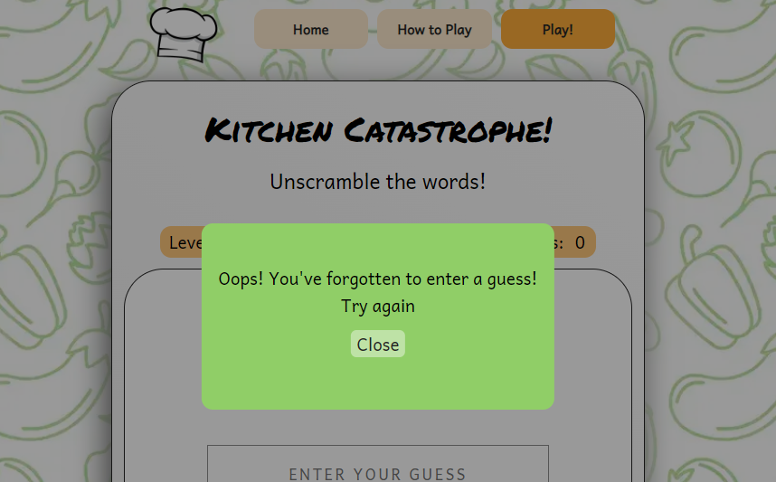

 

### **Accessibility**
I have taken the following steps in order to ensure my site is as accessible as possible:
- Clear and simple font styling, avoiding any cursive or calligraphic scripts for the majority of the text.
- Using complimentary colours
- As the background image is quite busy it was important to ensure my game board (and other information such as rules) were clearly seperated on a section with a white background.
- Addition of quick links in the navigation bar.
- Use of semantic HTML.
- Ensuring all images have an alt description for screen readers or where the image cannot be loaded. Also ensuring that these are as descriptive as possible.
- Ensuring the return button can be used to check the answer in the game, and that the modal can be closed by using the tab button on the keyboard to reach the close button. Also focus returns to the user answer box after the modal closes.

 

### **Future Features**
In the future there are features and developments I would like to consider adding to create an even better user experience of this website. They include:

- Have different scoring systems for playing with/without the clue 
- Track high scores and display these on a high scores page
- Music with an on/off toggle
- Different levels of difficulty that the user can chose to play
- Using an API to pull a much larger number of words into the array
- I struggled to trap the focus in the modal and return it to the correct place on the game page in all scenarios. This does now work in testing but I would like it work more seamlessly. I would like the user to simply be able to use the Enter button to dismiss the modal.

 

----

## Technologies
### **Languages Used**
This website has been written in HTML, CSS and JavaScript.

 

**Frameworks, Libraries and Programs Used**
- Github: Storing and hosting my code/repositories
- Gitpod: Code editor for writing my code and storing other images/files
- Font Awesome: For icons used throughout the site
- Google Fonts: To import the fonts used throughout the site
- Coolors: Colour palette picking website used to choose my colour scheme
- Shutterstock: Stock images
- Google DevTools: Used throughout the site's creation to test responsiveness and tweak layout
- Apple Safari Web Inspector: Used throughout to test responsiveness on iOS operating systems
- Balsamiq: Wireframe software
- Favicon.io: To create favicon
- Am I Responsive: To create a visual of the website across different device sizes
- [BIRME](https://www.birme.net/?) To resize images and convert to webp
- [Tiny PNG](https://tinypng.com/) To compress images
- [Gyazo](https://gyazo.com/) To create GIFs to use in the README

 

----

## Version Control
Version control has been maintained using Git. The code written for this website has been updated via regular commits to Github. These serve as a record of development and changes to the varying pages of html and css.

 

----

## Deployment
Github was used to deploy the website. The steps below were followed in order to achieve this:

1. Log in to Github account
2. Navigate to the project repository [here](https://github.com/llewellynksj/kitchen-catastrophe)
3. Click the 'Settings' button near the top of the page
4. Click the 'Pages' button from the left-hand menu
5. The 'Source' box should state 'Deploy from a branch'
6. Under the 'Branch' box click to select 'main'
7. Click 'Save'
8. It may take a few minutes to refresh but you will then be able to see the project has been made live

 

## How to Fork
1. Log in to Github account
2. Navigate to the project repository [here](https://github.com/llewellynksj/kitchen-catastrophe)
3. Click on the 'Fork' button in the top right corner of the page

## How to Clone
1. Log in to Github account
2. Navigate to the project repository [here](https://github.com/llewellynksj/kitchen-catastrophe)
3. Click on the green 'Code' button which will open a drop down menu
4. Copy the clone link you require (e.g. HTTPS/SSH)
5. In your code editor change the working directory to the location where you want the clone
6. Type 'git clone' and paste in the link

 

----

## Testing
Testing was performed across a range of devices, including:
- HP Elitebook 840 GS (1920 x 1080)
- HP Monitor (2560 x 1440)
- Surface Pro 6 (1368 x 912)
- Google Pixel 5

### **Function Testing**

| Page | Test | Successfully Completed |
| :----| :---| :----------------------:|
| All  |  | Yes |
| All  | Navigation links go to relevant page | Yes |
| All  |  | Yes |
| All  |  | Yes
| All  | Call to action buttons link to relevant page | Yes |
| All  |  | Yes |
| Homepage |  | Yes |
| Dates  |  | Yes |
| Support  |  | Yes |
| Support  |  | Yes |
| Contact  |  | Yes |
| Contact  |  | Yes |
| Contact  |  | Yes |

 

### **User Story Testing**

| First Time Visitor Goal | Solution | Tested & Successfully Completed |
| :----| :---| :----------------------:|
| I want to play an engaging word game |  | Yes |
| I want to test my food and drink knowledge  |  | Yes |
| I want to be able to play on any of my devices |  | Yes |
| I want to navigate easily  |  | Yes |

 

| Returning Visitor Goal | Solution | Tested & Successfully Completed |
| :----| :---| :----------------------:|
| I want to test my knowledge on new words | | Yes |
| I want to be able to decide if I can see the clues or not | | Yes |
| I want to be able to start the game without scrolling to the bottom of the homepage |  | Yes |

 

| Frequent Visitor Goal | Solution | Tested & Successfully Completed |
| :----| :---| :----------------------:|
| I want to test my knowledge on new words |  | Yes |
| I want to keep record of my score and challenge myself with harder levels
 |  | Yes |

 

### **Lighthouse**

For Mobile Devices

Homepage

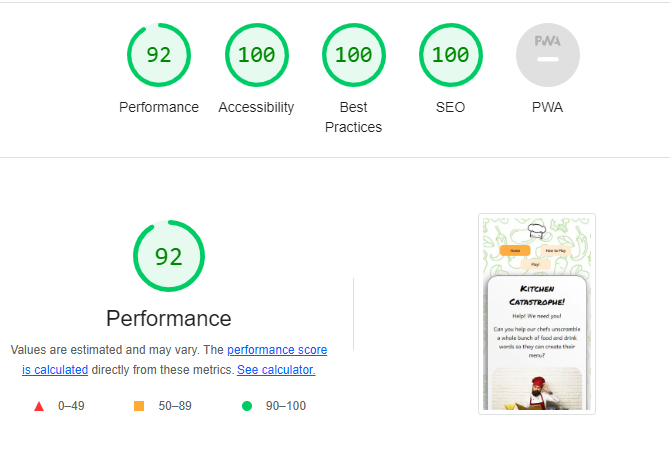

How to Play Page

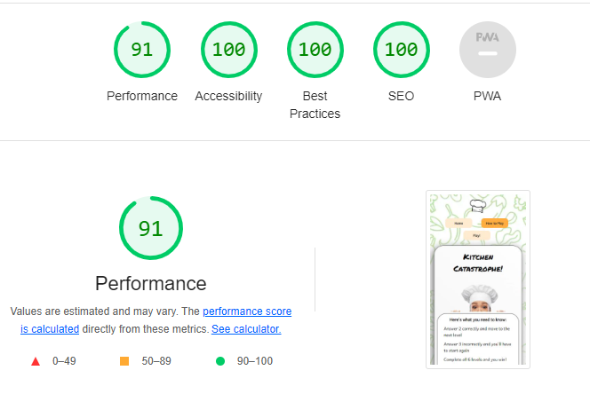

Game Page

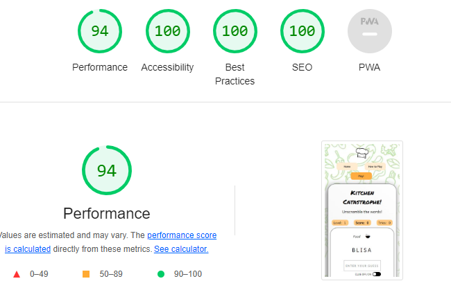

 

For Desktop

Homepage

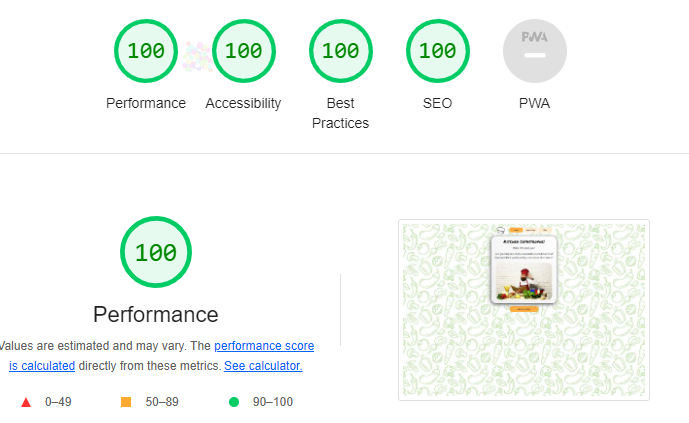

How to Play Page

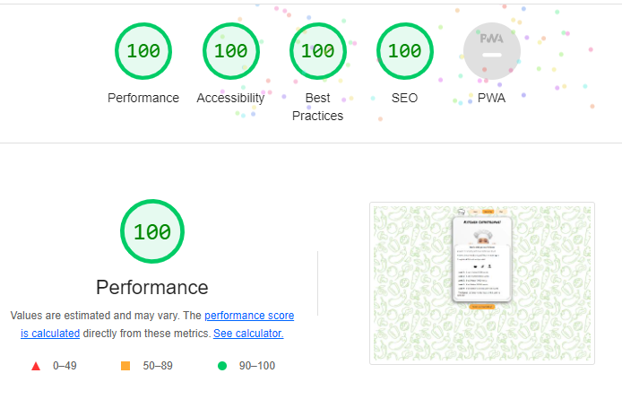

Game Page

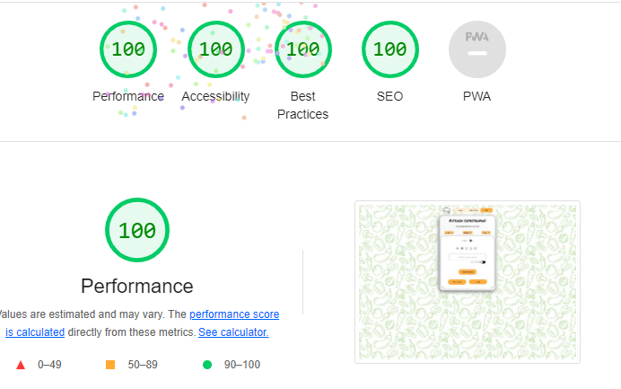

 

### **Validator Testing**
HTML

Homepage

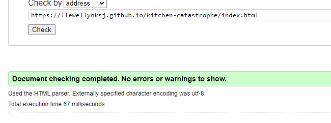

How to Play Page

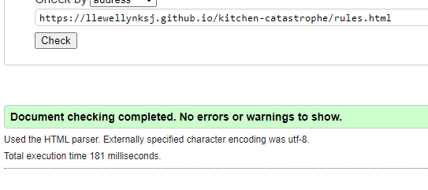

Game Page

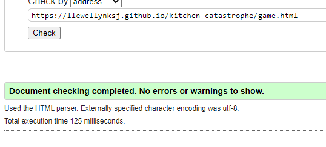

 

CSS

Stylesheet

  

### **Bugs**
  
  | Raised by | Bug | Solution |
  | :---      | :---| :---     |
  |  |  |  |
  |  |  |  |
  |  |  |  |
  |  |  |  |
  |  |  |  |
  |  |  |  |
  |  |  |
  |  |  |  |
  |  |  |  |
  |  |  |  |

 

----

## Credits
### **Resources**
- [Code Institute]() HTML and CSS learning content and for providing the [template]() used to start this website
- [Scrimba](https://scrimba.com/) - [JavaScript Tutorial]()
- [W3Schools](https://www.w3schools.com/) For general tips and advice on a variety of HTML, CSS and JavaScript
- 

 

### **Acknowledgements**

